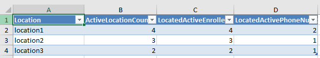

# RISE TECHNOLOGY ASSESSMENT

This is Rise Technology Assessment Project. You can check below for the project infrastructure and more information. 

## Domain
The project has a basic directory application domain. There are two projects that Directory Application and ReportGenerator. Directory application responsible for directory application transactions. And Report generator project is responsible for creating excel reports. You can see more information about project down below.

## Directory Application
Directory application is responsible for enrollee transactions such as create, update, delete and fetch. Also it is responsible for contact information transactions what informations can be added to enrollees.

In this project, The Onion Architecture has been implemented as a Clean Architecture implementation.
There are 5 layer, thats are domain, application, infrastructure, persistence and restful api. 

I used CQRS pattern, and implemented mediatr, automapper and fluent validation libraries. Also, i implemented rabbitmq message broker for async communication this app and report generator.

## Report Generator
Report generator project, has a simple domain. When this application running up, it is starting to listen a rabbitmq queue. When a create report request arrived to directory app, it publishes a message to the exchange-queue, then returns response immediately. 

This behaviour's reason is, creating report transaction may be take long time. We shouldn't keep the client waiting for this transaction. Report generator project will handle this.

When a message came into queue, Report generator executes some queries on the database, then create an excel report with this records.

  

  

